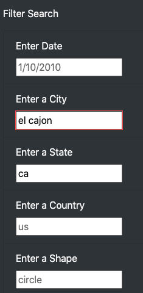
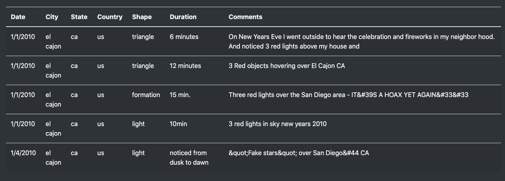
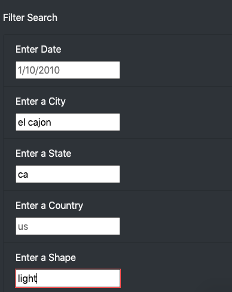
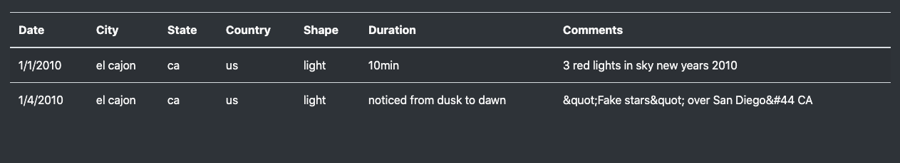

# ucb_bc_mod11_challenge

# UFOs

## Overview

The purpose of this is to allow users to search and filter for UFO information based on date, city, state, country, and shape.

## Usage
When you open the html the table will load with all of the data within our data.js file. You can then use the filters to search for whatever information you want in the table; you can even use multiple search criteria to look for something really specific (see images below). Additionally, you can easily reset the filters by clicking on "UFO Sightings" at the very top of the page.

### Filter for El Cojon

### Results

### Filter for El Conjon and Shape

### Results

## Enhancements
One drawback to this design is that the table is constantly being refreshed everytime you enter a new value in one of the filters, and by adding a button the table would only need to be refreshed once.

One enhancement would be to link this up to a database rather than a list of objects. This way the data and site could be maintained more easily.

Another enhancement would be to have a dropdown list for shapes and/or Country, so the user knows what can or cannot be accepted for those filters.
